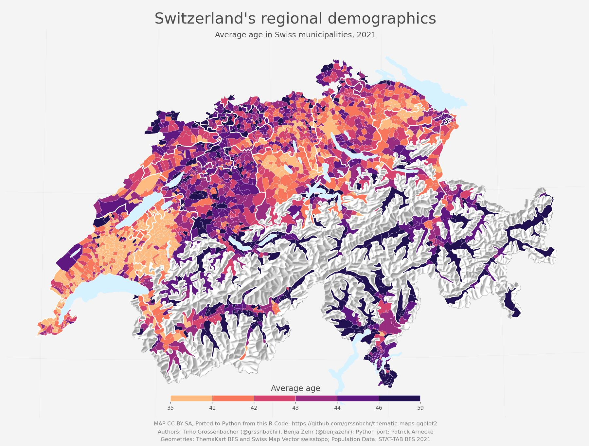

# Thematic Mapping Switzerland

 

In this notebook, I try to **port to Python a very clever and inspiring mapping technique that [Timo Grossenbacher](https://timogrossenbacher.ch/) and [Benja Zehr](https://benjazehr.ch/) have created in R.** 

**Please have a look at their blog posts [here](https://timogrossenbacher.ch/2016/12/beautiful-thematic-maps-with-ggplot2-only/) and [here](https://timogrossenbacher.ch/2019/04/bivariate-maps-with-ggplot2-and-sf/) where they describe all the thinking and work behind it.** 

> **All the credit for this beautiful mapping technique belongs entirely to Timo and Benja.** 

I just was curious how hard it would be to port their project to Python and wanted to make their approach available for Python users. I was also interested how close one can get with Python's plotting tools (namely Matplotlib) to the ggplot2 result. I merely ported the code to Python and kept as closely to Timo's and Benja's settings as possible. 

**What did I find out?**

- It goes without saying: Python's geo data and graph tooling work differently than R's. So a simple 1:1 conversion of the code wasn't feasible. Nonetheless, many of the steps the authors created could be applied in this version too. 
- Visually the result comes quite close to the original (at least in my perspective).
- Controlling a map layout with all elements pixelperfect is not an easy task in matplotlib. This seems somewhat easier in R/ggplot. 
- A versatile GIS tool was an absolute must to explore the geo data sets efficiently and find the right shapes. [QGIS](https://www.qgis.org/en/site/) (which I use) was very helpful just to browse and understand the various layers of the awesome and quite detailed geo data offerings of the [Federal Statistical Office BFS](https://www.bfs.admin.ch/bfs/en/home/statistics/regional-statistics/base-maps/cartographic-bases.html) and [Federal Office of Topography swisstopo](https://www.swisstopo.admin.ch/en/geodata/maps.html). 
- It was **more difficult than I expected to find a proper workflow in Python to mask raster maps with vector shapes**. One can either mask the layer with QGIS ([see second notebook in repo](02_Mask-Raster-With-QGIS.ipynb)) or cut out the shape with [gdal](https://gdal.org/)'s Python bindings directly in the noteebook (see below).

**Usage**
- Install the required packages with `pip install -r requirements.txt`.
- An easy way to install GDAL (necessary to run the notebook): `conda install -c conda-forge gdal`.
- Run all cells in the [main notebook](01_Thematic-Mapping.ipynb) 

**⚠️ Important note**

- To work with this notebook you need to download three data sets (the code for that is provided in the notebook). 
- **You need to check the terms of usage for the data on the respective sites – see links in the notebook – and use the data accordingly.** 
- This notebook is created **purely for educational purposes** and comes **without any licenses for the data.** 

*License concerning the code and the maps produced: CC-BY-SA (as defined by original authors).* 
*Data licenses: See respective websites of data providers. Links are provided in the Jupyter notebook.*
